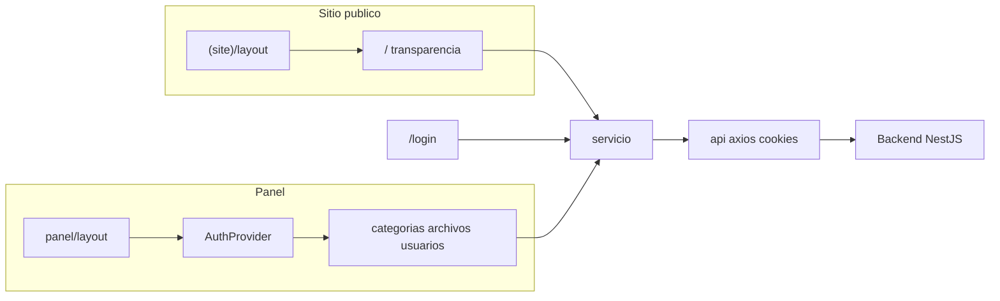

# Arquitectura del frontend — Portal Gobierno Abierto

Documentación de cómo está organizado el código, el routing, la integración con el backend y las particularidades del **build estático**.

Para levantar el proyecto, variables de entorno y despliegue, ver [README.md](../README.md). Para la API y seguridad del servidor, ver [gobierno-abierto-backend/README.md](../../gobierno-abierto-backend/README.md).

---

## Mapa de carpetas (`src/`)

```
src/app/          → Rutas (App Router): (site), login, panel
src/components/   → UI (public, layout, forms, panel, providers)
src/services/     → api.ts (axios) + service.ts (servicio)
src/types/        → Contratos TypeScript
src/lib/          → Utilidades (theme MUI, slugify, panelSections, etc.)
```

| Carpeta | Rol |
|---------|-----|
| `app/(site)/` | Sitio público con `Header` / `Footer` |
| `app/login/` | Página de login (fuera del panel) |
| `app/panel/` | Panel admin con `AuthProvider`, sidebar y header |
| `components/providers/` | `AuthProvider`, `MuiThemeProvider` |
| `components/forms/` | Formularios (login, categorías, archivos, contacto) |
| `components/public/` | Bloques de la home y transparencia |

Imports: alias `@/*` → `src/*` (ver `tsconfig.json`).

---

## Flujo general



El sitio público y el panel comparten la capa **`servicio`**; solo el panel exige sesión activa vía `AuthProvider`.

---

## Routing y layouts

### Grupo `(site)`

`src/app/(site)/layout.tsx` envuelve las páginas públicas con `Header` y `Footer`. No ejecuta verificación de auth en cada carga.

Rutas relevantes:

- `(site)/page.tsx` → `/`
- `(site)/transparencia/` → listado
- `(site)/transparencia/[categoryName]/` → detalle por slug

### Panel

`src/app/panel/layout.tsx` es cliente (`"use client"`) e incluye:

- `AuthProvider` — verifica sesión al montar
- `PanelHeader`, `PanelSidebar`

`AuthProvider` **no** está en el root layout (`src/app/layout.tsx`); allí permanece comentado a propósito: la autenticación solo aplica al panel. Activar auth global rompería el flujo del sitio público y no aporta valor (las páginas públicas no llaman a `verify` en cada visita).

### Login

`/login/` está fuera de `panel/` para no anidar dos flujos de redirección.

### Rutas dinámicas: `page.tsx` + `pageClient.tsx`

Patrón usado en transparencia y archivos del panel:

- **`page.tsx`** (servidor en build): `generateStaticParams()` obtiene categorías del backend y define slugs.
- **`pageClient.tsx`** (`"use client"`): datos interactivos, tablas, subidas, etc.

Ejemplo en transparencia:

```11:16:gobiernoAbiertoFrontend/src/app/(site)/transparencia/[categoryName]/page.tsx
export async function generateStaticParams() {
  const res = await servicio.getCategorias();
  return res.map((cat: Category) => ({
    categoryName: cat.slug,
  }));
}
```

Mismo patrón en `panel/archivos/[categorySlug]/`.

### Protección de rutas

No hay `middleware.ts`. La protección del panel es:

1. `AuthProvider` → `servicio.verify()` → redirect a `/login/` si no hay usuario.
2. Interceptor de axios en `api.ts` → 401 en peticiones autenticadas → `window.location.href = "/login/"` (excepto `/auth/verify`).

---

## Capa de API

### Regla

Los componentes y páginas importan **`servicio`** desde `@/services/service`, no `api` directamente.

### `api.ts`

- `baseURL`: `process.env.NEXT_PUBLIC_BACKEND_PATH`
- `withCredentials: true` — envía cookies de sesión
- Interceptor de respuesta: en **401**, redirige a `/login/` salvo si la URL es `/auth/verify` (para que `AuthProvider` maneje el fallo sin recargar en bucle)

### `servicio` ↔ endpoints

| Método `servicio` | HTTP | Endpoint |
|-------------------|------|----------|
| `login` | POST | `/auth/login/` |
| `verify` | GET | `/auth/verify` |
| `logout` | POST | `/auth/logout` |
| `changeOwnPassword` | PATCH | `/auth/me/password` |
| `listUsers` | GET | `/user` |
| `createManagedUser` | POST | `/user` |
| `adminResetUserPassword` | PATCH | `/user/:id/password` |
| `actualizarUsuario` | PATCH | `/user/:id` |
| `eliminarUsuario` | DELETE | `/user/:id` |
| `getCategorias` | GET | `/category` |
| `getUnaCategoria` | GET | `/category/:id` |
| `getArchivosDeUnaCategoria` | GET | `/file/cat/:slug` |
| `getUltimosArchivosDeUnaCategoria` | GET | `/file/cat/:slug/latest` |
| `insertArchivo` | POST | `/file/upload` |
| `editarArchivo` | PATCH | `/file/:id` |
| `borrarArchivo` | DELETE | `/file/:id` |
| `descargarArchivo` | GET | `/file/download/:id` |
| `descargarGuia` | GET | `/file/guide/download` |
| `insertarCategoria` | POST | `/category` |
| `borrarCategoria` | DELETE | `/category/:id` |
| `editarCategoria` | PATCH | `/category/:id` |
| `sendEmail` | POST | `/email/contact` |

Listado completo de endpoints del servidor: documentación del backend / Swagger cuando esté habilitado.

---

## Autenticación

- El backend emite JWT en **cookie HTTP-only** (no se guarda token en `localStorage`).
- Flujo panel: montaje → `verify` → si hay usuario, render del panel; si no, `router.push('/login/')`.
- Login: `servicio.login` → cookie establecida por el backend → navegación al panel.
- Logout: `servicio.logout`.

Alineado con la capa de seguridad del backend (JWT, CORS, cookies). En despliegue, origen del frontend y dominio de la cookie deben ser compatibles.

---

## Estado y comunicación entre componentes

- Sin Redux ni Zustand global.
- Estado de sesión: `AuthContext` en `AuthProvider`.
- Resto: estado local de componentes y props.

### Evento `panel:categories-changed`

Tras crear, editar o borrar categorías en `panel/categorias/page.tsx` se dispara:

```ts
window.dispatchEvent(new Event("panel:categories-changed"));
```

`PanelSidebar` escucha el evento y vuelve a cargar categorías para el menú sin recargar toda la página.

---

## Build estático: implicaciones

Configuración en `next.config.ts`:

- `output: "export"` → salida en `out/`
- `trailingSlash: true` → URLs con barra final (Apache-friendly)
- `images.unoptimized: true` → sin optimización en servidor (no hay servidor en export)

### Build time vs runtime

| Aspecto | Comportamiento |
|---------|----------------|
| Rutas por categoría | Se generan en `npm run build` vía `generateStaticParams` |
| Backend en CI | Debe estar accesible con la misma `NEXT_PUBLIC_BACKEND_PATH` o el build puede fallar / omitir slugs |
| Nuevas categorías tras deploy | Requiere **nuevo build** para nuevas URLs estáticas en transparencia/panel |
| `npm run start` | Modo desarrollo Node; producción estática = servir `out/` |

### Server actions y Resend

`src/lib/resendAction.ts` define `submitContactForm` con `RESEND_API_KEY`. El formulario de contacto actual usa **`servicio.sendEmail`** (backend). Con export estático, las server actions no son el camino principal de producción; el envío de correo institucional debe documentarse en el backend.

### Assets

Archivos estáticos en `public/` (imágenes, favicon, etc.) se copian a `out/` en el build.

---

## Convenciones rápidas

- UI y mensajes al usuario: **español**.
- Rutas dinámicas: `page.tsx` (build/params) + `pageClient.tsx` (interactividad).
- Slugs de categoría: `toSlug` en `@/lib/slugify` para alinear con el backend.
